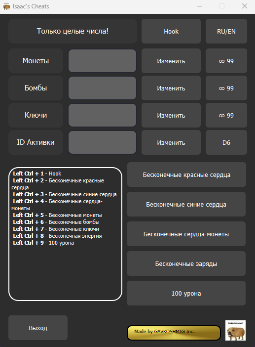

# Описание
Трейнер для The Binding of Isaac: Repentance.
Написан на Python с использованием [ReadWriteMemory](https://github.com/vsantiago113/ReadWriteMemory) и PyQt6.
# Возможности
1. Изменить значение Монет, зафиксировать его на 99
2. Изменить значение Бомб, зафиксировать его на 99
3. Изменить значение Ключей, зафиксировать его на 99
4. Изменить значение ID Активного предмета, или поменять его на D6
5. Включить бесконечные красные сердца
6. Включить бесконечные синие сердца
7. Включить бесконечные сердца монеты
8. Включить бесконечные заряды активного предмета
9. Включить 100 урона
10. Поменять язык на английский или русский
# Требования
Python 3.11.2+
OS: Windows 11
# Установка
При создании была использована библиотека ReadWriteMemory не из pip.
Чтобы использовать такую же как здесь версию нужно:
1. Скачать __init__.py с этого [репозитория.](https://github.com/vsantiago113/ReadWriteMemory/blob/master/ReadWriteMemory/__init__.py)
2. Поставить вместо того что лежит в вашей папке ReadWriteMemory
# Оформление

